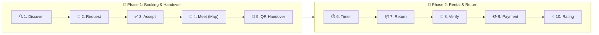

  

    

  

    

  <h3>Share. Borrow. Return.</h3>

  
<strong>A university-focused short-term product sharing platform.</strong>

   

  

 

## 📖 About

**BorrowBox** is an Android application that allows university students to **share and borrow products for short periods** instead of purchasing them.

Students can list products, set rental prices and availability, request products from other students, complete verified handovers, track rental time, and return products safely.

## ✨ Core Features

* 👤 Student profile with university & department
* 📦 Product listing with price, condition & availability
* 🔎 Search & filter available products
* 🤝 Rental request & owner approval
* 📱 QR-based product handover & return
* ⏱️ Rental timer & return reminders
* 💳 Rental cost, security deposit & late-fee calculation
* 📸 Product condition & damage verification
* ⭐ Ratings & Trust Score
* 🚨 Emergency rental requests
* 📍 **Nearby Sharing Map** — after both students confirm the meeting, both users can see **each other's location and the distance between them on a map**

## 📍 Nearby Sharing

When two students confirm a rental handover, BorrowBox helps them find each other on campus (illustrated below at **Daffodil International University — Daffodil Smart City** between **AB-4 (CSE Dept)** and the **Central Library**, meeting at **Daffodil TSC**).

  

Both students can see:

* Their current location on campus
* The other student's live location
* Real-time distance & estimated walking time (e.g., `500 m · ~4 min walk`)
* Designated safe meeting point on the map (e.g., **Daffodil TSC**)

## 🔄 Rental Flow

| Step | Stage | Action & Purpose |
| :---: | :--- | :--- |
| `01` | **🔍 Discover** | Search by category, university department, price, and immediate availability. |
| `02` | **📨 Request** | Select rental hours or days, view total transparent cost, and submit booking. |
| `03` | **✅ Accept** | Product owner checks borrower's Trust Score and confirms the rental request. |
| `04` | **📍 Meet Nearby** | Both students share real-time campus map locations to easily meet up. |
| `05` | **📱 QR Handover** | Scan owner's QR code on-screen to instantly authenticate product handover. |
| `06` | **⏱️ Rental Timer** | Active countdown runs in the background with timely return reminders. |
| `07` | **🔄 Return** | Borrower meets owner before expiry to safely return the borrowed item. |
| `08` | **📸 Condition Verify** | Side-by-side photo comparison to ensure no damages occurred. |
| `09` | **💳 Payment** | Secure payment settlement with deposit refund and automated receipt. |
| `10` | **⭐ Rating & Trust** | Mutual 5-star reviews to update campus Trust Scores and reliability. |

## 🛠️ Technology

* **Language & Architecture:** Java · Object-Oriented Programming (OOP)
* **Platform & IDE:** Android SDK · Android Studio
* **Database & Cloud:** SQLite (Local) · Firebase (Realtime Database & Authentication)
* **Location & Handover:** Google Maps Platform · GPS Location Services · QR Code Scanner
* **Services & Alerts:** Android Notifications (FCM) · Payment & Security Deposit Calculation

## 🎯 Goal

To create a **trusted university sharing community** where students can quickly access products they need for a short time without unnecessary purchases.

## 👥 Contributors

| # | Contributor Name | Student ID |
| :---: | :--- | :---: |
| 1 | **Muhammad Tanjeem** | `252-15-817` |
| 2 | **Md. Sabbir Hossain Shamim** | `252-15-825` |
| 3 | **Chandan Acharjee Himel** | `252-15-891` |
| 4 | **Mst Tasnim Binty Ekram** | `252-15-074` |
| 5 | **Md. Rafiul Islam Rafi** | `252-15-105` |

 

  

  <h3>📦 BorrowBox</h3>

  
<strong>Share what you have. Borrow what you need.</strong>

   

  

